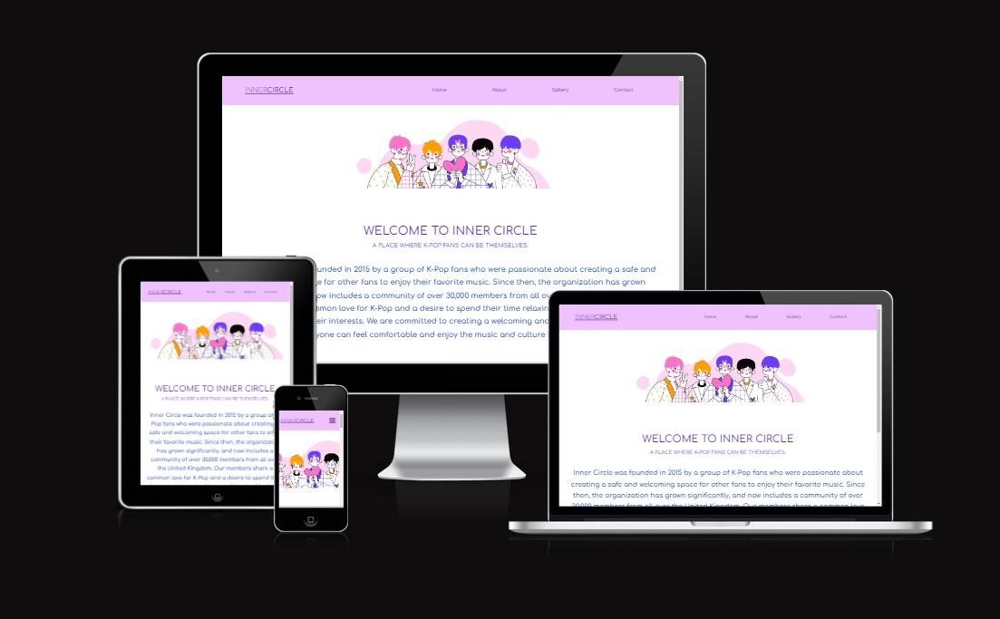
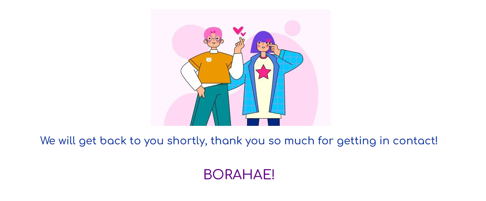

# INNER CIRCLE.

At Inner Circle, we strive to provide a safe and welcoming environment for all fans of K-pop. Our community is open to both new and experienced fans of the genre, and we aim to foster a sense of connection and support among our members. Our goal is to create a space where K-pop fans can come together to share their passion for the music, learn from each other, and make lasting connections with others who share their interests. Whether you're an avid K-pop fan or just starting to discover this exciting genre, Inner Circle is the perfect place to connect with other fans and learn more about the world of K-pop.

[View deployed site here](https://sandrac98.github.io/innercircle/)

The goals of this website are:
* Provide information about what the project is about.
* Provide pictures of what can be expected at the events.
* Encourage visitor to get in contact through the contact form.

# UX
## Ideal client
### The ideal visitor for this website is:

* someone who is a fan of Korean Pop Music
* Has disposable income
* either currently lives in the United Kingdom or is planning to visit soon.
* This visitor is likely to be interested in the events and resources offered on the website and would be able to fully engage with and benefit from the content.

### Client stories
1. As a new visitor to the website, it is important for me to be able to easily navigate the site in order to efficiently find the information or resources that I need. A clear and intuitive navigation structure will help me to quickly locate the content I am looking for and will make my experience using the site more enjoyable. 
2. As a new visitor to the website, I am interested in learning about the organization and its history. This information can help me to better understand the work that the organization does and how it fits into the larger community.
3. As a new visitor to the website, I am interested in learning about the events that are offered by the organization. This would allow me to understand what to expect from the events and help me to decide whether they are a good fit for my interests and needs.
4.As someone who is interested in participating in the events offered by Inner Circle, it would be helpful for me to follow the organization's social media pages so that I can stay up to date on the latest news and information about upcoming events.

## Features 
### Existing Features
  Each page features a responsive navigation bar that is fixed in place and appears on every page of the site. This navigation bar includes links to the different pages of the website, such as the home page, about us page, gallery page, and the contact us page. 
  

The navigation bar is designed to be responsive, which means that it will adjust its layout and appearance to fit different screen sizes and devices. On small devices, the navigation bar will convert into a hamburger menu to allow for easier access. By including this navigation bar, the aim is to make it easy for users to move from page to page on the website and access the different sections without having to use the back button.
[Nav Bar Small Device](./navbar-small-screen.png)
- __Home Page__

 - The home page includes an illustration that is related to K-pop and a description of the project. The illustration may be used to help set the theme or tone of the site and give visitors an idea of what they can expect to find on the website. The description of the project may provide more information about the history and purpose of Inner Circle, including when it was founded and what it aims to accomplish. This information can help visitors understand more about the project and its goals, and may help to establish trust and credibility with the audience.
[Home Page](./homepage.png)
- __The Footer__ 

  - The footer section includes links to Inner Circle's social media accounts, which will allow visitors to connect with the organization and stay updated on its activities. By opening these links in a new tab, it is making it easy for users to access the social media accounts without navigating away from the website. The footer section also includes information on how visitors can stay informed about events and other happenings at Inner Circle. This include details about where and when events are taking place. By providing this information in the footer, it is making it easy for visitors to stay connected with Inner Circle and stay up to date on its activities.

- __About Us__

  - Provides more information about what visitors can expect at Inner Circle events. visitors get a better sense of what to expect at Inner Circle events and what they can look forward to. This can help build excitement and interest in the events, and may encourage visitors to attend or get more involved with Inner Circle. It also includes an illustration that features characters making the "Korean heart fingers" gesture. This gesture, also known as the "finger heart," is a common way for people in South Korea to show love or affection. It is made by placing the tip of the index finger against the tip of the thumb, forming a heart shape with the other fingers. The use of this illustration on the about us page of the website is intended to give visitors a sense of the theme or tone of the site, and to signal that Inner Circle is a community for fans of K-pop and Korean culture. It may also be used to convey a sense of warmth and positivity, and to help visitors feel welcome and included in the community.
[About Us Page](./about-us.png)
  - __Gallery__

  - The gallery page includes a collection of photos that showcase various aspects of K-pop culture, including merchandise, events, and people enjoying themselves. By displaying these photos, visitors get a visual representation of what Inner Circle is all about and what they can expect to find in the community. The inclusion of photos of merchandise, events, and people dancing and looking at food can help to give visitors a sense of the variety of experiences and activities that are available at Inner Circle, and may help to pique their interest in getting more involved with the community. Additionally, by showcasing these photos, gives visitors a sense of the energy and excitement that are present at Inner Circle events, which could help to further build interest and enthusiasm in the community. [Gallery](./gallery.png)
- __Contact Us Page__

  - On this page, users will have the opportunity to submit any questions they have about the events. To send their question, users are required to provide their name, email address, and message. The form allows users to enter this information and submit it for review.

   __Form submitted Page__
   - This page includes an illustration and displays a confirmation message after the form has been successfully submitted. The message lets the user know that their form has been received and that they will be contacted back.
  

### Features Left to Implement

- I envision turning Inner Circle into an online store in the future, allowing anyone interested in purchasing official merchandise to do so without the necessity of attending an event. 
- In addition to converting Inner Circle into an online store, I also plan to add a calendar feature to the website, which will include information on upcoming events such as location and start time. Users will also have the option to create an account and register for these events.

## Testing 

In this section, you need to convince the assessor that you have conducted enough testing to legitimately believe that the site works well. Essentially, in this part you will want to go over all of your project’s features and ensure that they all work as intended, with the project providing an easy and straightforward way for the users to achieve their goals.

In addition, you should mention in this section how your project looks and works on different browsers and screen sizes.

You should also mention in this section any interesting bugs or problems you discovered during your testing, even if you haven't addressed them yet.

If this section grows too long, you may want to split it off into a separate file and link to it from here.

### Validator Testing 

- HTML
I utilized the W3 Validator to check each page of the website and found some errors in the navbar. However, this code was sourced from another website and I have included a link to the original source in the code. As a result, I have not attempted to fix the errors highlighted by the validator.
[navbar-error](./navbarerror.png)

- CSS
  - No errors were found when passing through the official [(Jigsaw) validator](./css-validator.png)
### Unfixed Bugs

You will need to mention unfixed bugs and why they were not fixed. This section should include shortcomings of the frameworks or technologies used. Although time can be a big variable to consider, paucity of time and difficulty understanding implementation is not a valid reason to leave bugs unfixed. 

## Deployment

This section should describe the process you went through to deploy the project to a hosting platform (e.g. GitHub) 

- The site was deployed to GitHub pages. The steps to deploy are as follows: 
  - In the GitHub repository, navigate to the Settings tab 
  - From the source section drop-down menu, select the Master Branch
  - Once the master branch has been selected, the page will be automatically refreshed with a detailed ribbon display to indicate the successful deployment. 

The live link can be found here - https://sandrac98.github.io/innercircle/

## Credits 
### Content 

- The text for the for the text in this website was created using https://www.copy.ai/
- The icons in the footer were taken from [Font Awesome](https://fontawesome.com/)

### Media
- The image for the Home Page and Contact Form was taken from this open source website:
<a href="https://www.freepik.com/free-vector/group-k-pop-boys-illustrated_9644919.htm#query=kpop&position=0&from_view=search&track=sph">Image by pikisuperstar</a> on Freepik
- The image for the About Us page was taken from this open source website:
<a href="https://www.freepik.com/free-vector/young-korean-people-doing-finger-heart_9644839.htm#query=kpop&position=34&from_view=author">Image by pikisuperstar</a> on Freepik

